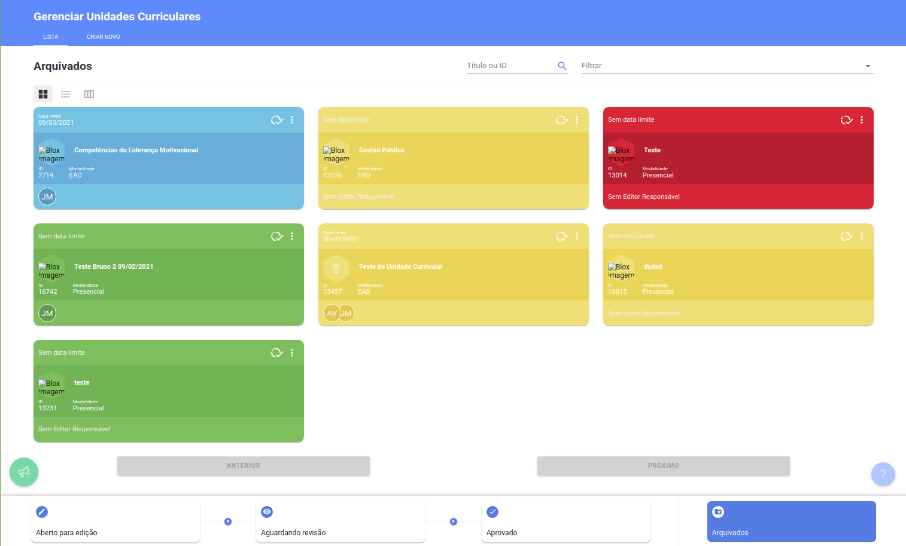
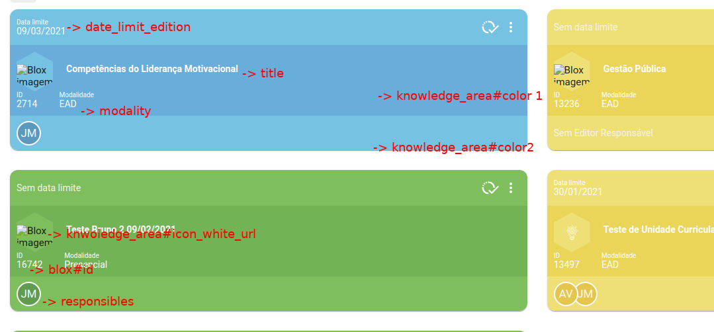
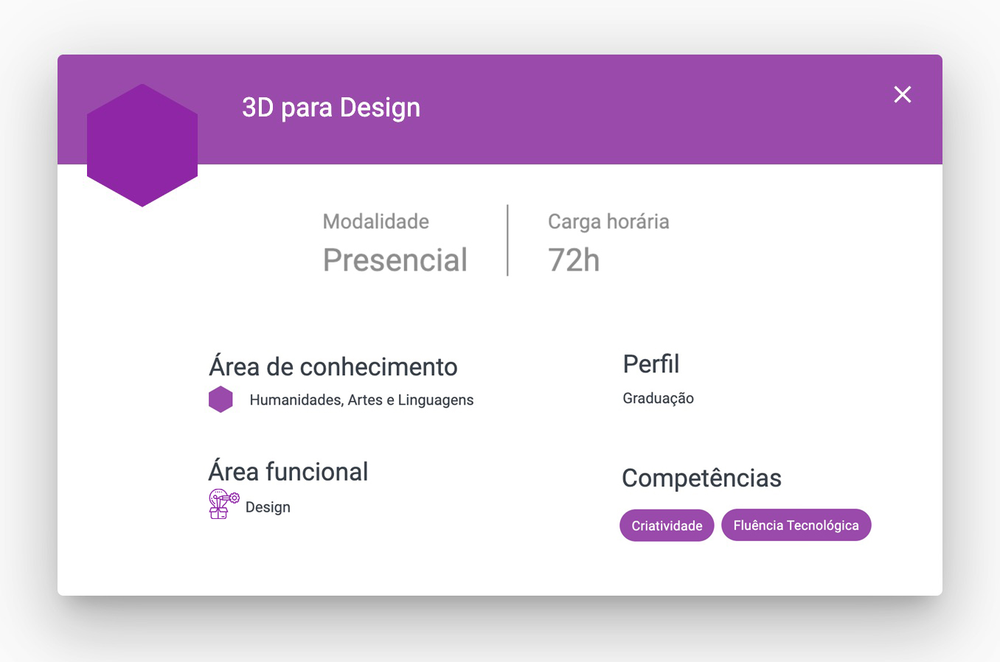

# Sobre a Empresa

  Blox é uma EdTech que propõe uma abordagem radicalmente nova no ensino superior.
Acreditamos que cada aluno é único e que portanto, sua trilha formativa também
deveria ser única, personalizada às suas necessidades. Desenvolvemos todas as
ferramentas e processos necessários para apoiar as universidades na verdadeira
transformação da educação.

[Website](https://blox.education)

[Youtube](https://www.youtube.com/channel/UCoU3Z5EheoYz3YQFRAaaeTw)

# Sobre o teste

  Este teste é apresentado às pessoas que estão se candidatando às vagas de
desenvolvimento front-end para avaliar os quesitos técnicos. O código deve ser escrito
utilizando TypeScript + React JS.

## O Desafio

Seu objetivo é implementar o front-end de três telas.
- Tela de Cadastro (rota pública)
- Tela de Login (rota pública)
- Tela de Listagem de Unidades Curriculares (rota privada)

A Tela de cadastro deverá conter os seguintes campos: 

  

A tela de login deverá conter os seguintes campos:

  

A Tela de Listagem de listagem de Unidades Curriculares a partir da resposta JSON de uma API.

Você pode usar o aplicativo INSOMINA ( https://insomnia.rest/download ) ou POSTMAN (https://www.postman.com/downloads/) para testar os "curls" abaixo de uma forma mais interativa.

Os endpoints a serem usados nesse desafio são:

### POST - Cadastro de Usuário

`curl --request POST \
  --url https://api-dev.blox.education/auth \
  --header 'Accept: application/json, text/plain, */*' \
  --data '{"institution_id":22,"name":"Jo\xe3o Maria Jos\xe9","email":"exemplo@oi.com","username":"exemplo@oi.com","password":"teste123","password_confirmation":"teste123","cpf":"87444473021","birth_date":"1992-12-19","allow_emails":false,"confirm_success_url":"https://dev.blox.education/public/22/offerings"}' `

Você pode utilizar o gerador de CPF a partir deste site para testar o formulário: https://www.4devs.com.br/gerador_de_cpf

### POST - Login
Manter o `institution_id`

`curl --request POST \
  --url https://api-dev.blox.education/v2/authentication/login \
  --header 'Content-Type: application/json' \  
  --data '{
	"username": "exemplo@oi.com",
	"password": teste123,
	"institution_id": 22
}'`

Com isso será possível obter o token JWT.
  

### GET - Curricular Units

Esta rota não exige autenticação.

`curl --request GET \
  --url 'https://api-dev.blox.education/v1/public/institutions/22/blox_offerings?page=1&per=5' \
  --header 'Accept: application/json, text/plain, */*' \`

Retorna a listagem de unidades curriculares a serem implementadas como listagem. 

### Mapeamento dos campos

### Requisitos
  - Utilização a lib Material UI (https://mui.com/)
  - Validação de campos CPF e Email no formulário de cadastro
  - Deve ser possível paginar as unidades curriculares
  - Deve ser possível listar as unidades curriculares de acordo com sua situação. `blox#status`

### O que esperamos

 - Utilização de versionamento de código (git)
 - Criar uma documentação de como rodar sua aplicação - README
 - Criar uma breve descrição da solução utilizada

### Avaliação

Ao final do desafio, esperamos que a solução apresentada permita o seguinte fluxo:
1. Criação de usuário
2. Logar com o usuário recém-criado
3. Após logar, exibir a tela de Listagem de Unidades Curriculares.

Pontos analisados: 
  - Compreensão dos requisitos
  - Aplicação de conceitos de clean code, DRY, SOLID, KISS, YAGNI, etc.
  - Compreensão do ecossistema React, React Hooks e seus fundamentos
  - Estruturação dos componentes
  - Estruturação do CSS
  - Utilização de [Context API](https://reactjs.org/docs/context.html)

### Plus / Diferencial / Opcional

  - Desafio extra para os que querem ir além. Não é obrigatório o mini-desafio abaixo para sua entrega ser avaliada.

  - Feature extra: Modal de detalhes

  

  - Styled Components
  - Teste dos componentes (JEST)
  - Web hooks

### Entrega do desafio

  - O código deve ser disponibilizado no github para avaliação.
  - A aplicação deve ser disponibilizada remotamente.
    Ex: [Heroku Deploy](https://blog.heroku.com/deploying-react-with-zero-configuration) || [Vercel](https://vercel.com/)
